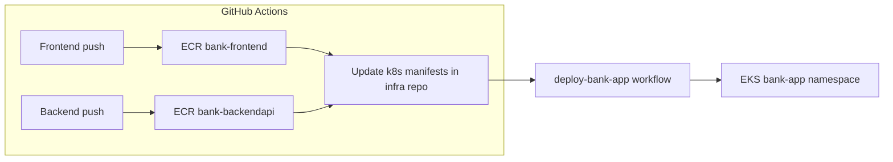

# Pod10 Bank App — Deployment Guide

Wire-up between **infrastructure**, **backend**, and **frontend** for `gwinseapptest.online`.

| Component | URL | ECR repository |
|-----------|-----|----------------|
| Frontend | https://bank.gwinseapptest.online | `bank-frontend` |
| Backend API | https://bankapi.gwinseapptest.online | `bank-backendapi` |
| ArgoCD | https://argocd.gwinseapptest.online | — |

Kubernetes manifests live in [`k8s/bank-app/`](k8s/bank-app/).

---

## 1. Prerequisites

- Terraform stack applied (`Pod10-infrastructure-main`)
- Route53 nameservers for `gwinseapptest.online` pointed at AWS (from `terraform output route53_name_servers`)
- `kubectl` access to cluster `eks-cluster` in `us-east-1`
- cert-manager + nginx ingress running (from Terraform Helm)

---

## 2. GitHub configuration (all 3 repos)

Use the same secrets on **Pod10-infrastructure-main**, **Pod10-main-bank-app-frontend**, and **Pod10-main-bank-app-backend**:

### Repository secrets

| Secret | Description |
|--------|-------------|
| `AWS_ACCESS_KEY_ID` | IAM user/role with ECR push + EKS describe |
| `AWS_SECRET_ACCESS_KEY` | AWS secret key |
| `TF_VAR_DB_USERNAME` | RDS master username (infrastructure repo only) |
| `TF_VAR_DB_PASSWORD` | RDS master password (infrastructure repo only) |
| `GIT_USERNAME` | GitHub username for manifest updates |
| `GIT_PASSWORD` | GitHub PAT with `repo` scope (for CI to push manifest tag updates) |

### Repository variables (frontend + backend repos)

| Variable | Example | How to get it |
|----------|---------|---------------|
| `ECR_REPO` | `123456789012.dkr.ecr.us-east-1.amazonaws.com` | `aws sts get-caller-identity --query Account --output text` then `ACCOUNT.dkr.ecr.us-east-1.amazonaws.com` |

Set via GitHub UI: **Settings → Secrets and variables → Actions**, or:

```bash
gh variable set ECR_REPO --repo gwinsetechcloud-ctrl/Pod10-main-bank-app-frontend --body "YOUR_ACCOUNT.dkr.ecr.us-east-1.amazonaws.com"
gh variable set ECR_REPO --repo gwinsetechcloud-ctrl/Pod10-main-bank-app-backend --body "YOUR_ACCOUNT.dkr.ecr.us-east-1.amazonaws.com"
```

---

## 3. One-time cluster setup

### 3.1 RDS endpoint in ConfigMap

After `terraform apply`:

```bash
terraform output -raw rds_endpoint
```

Edit [`k8s/bank-app/backend-configmap.yaml`](k8s/bank-app/backend-configmap.yaml) — set `DB_HOST` to the RDS hostname **without** the `:3306` port suffix.

```bash
kubectl apply -f k8s/bank-app/backend-configmap.yaml
```

### 3.2 Database secret

Use the same credentials as `TF_VAR_DB_USERNAME` / `TF_VAR_DB_PASSWORD`:

```bash
kubectl create namespace bank-app 2>/dev/null || true

kubectl create secret generic bank-backend-secret -n bank-app \
  --from-literal=DB_USERNAME='YOUR_RDS_USER' \
  --from-literal=DB_PASSWORD='YOUR_RDS_PASSWORD' \
  --dry-run=client -o yaml | kubectl apply -f -
```

### 3.3 ClusterIssuer

```bash
kubectl apply -f ClusterIssuer.yaml
```

---

## 4. Build & deploy flow



1. Push to **backend** `main` → builds image → updates `k8s/bank-app/backend-deployment.yaml` image tag in infra repo.
2. Push to **frontend** `main` → builds image → updates `k8s/bank-app/frontend-deployment.yaml` image tag.
3. Run **Deploy Bank App to EKS** workflow on `Pod10-infrastructure-main` (Actions → Deploy Bank App to EKS → Run workflow).

Or apply locally:

```bash
aws eks update-kubeconfig --name eks-cluster --region us-east-1
kubectl apply -f k8s/bank-app/
```

---

## 5. Verify

```bash
kubectl get pods,ingress -n bank-app
curl -I https://bankapi.gwinseapptest.online/api/user/login
curl -I https://bank.gwinseapptest.online
```

Open https://bank.gwinseapptest.online and test login/register.

---

## 6. Troubleshooting

| Issue | Check |
|-------|--------|
| Frontend loads but API fails | Browser network tab; API must be `https://bankapi.gwinseapptest.online` |
| CORS errors | `CORS_ALLOWED_ORIGIN` in ConfigMap = `https://bank.gwinseapptest.online` |
| Backend crash loop | `kubectl logs -n bank-app deploy/bank-backend-deployment`; verify RDS security group allows EKS nodes |
| TLS not issued | `kubectl describe certificate -n bank-app`; cert-manager logs |
| Image pull errors | ECR image exists; node IAM can pull from ECR |

---

## 7. Repositories

- https://github.com/gwinsetechcloud-ctrl/Pod10-infrastructure-main
- https://github.com/gwinsetechcloud-ctrl/Pod10-main-bank-app-frontend
- https://github.com/gwinsetechcloud-ctrl/Pod10-main-bank-app-backend
