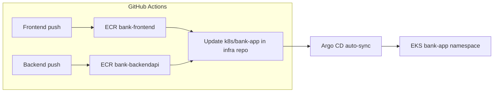

# Pod10 Bank App — Deployment Guide

Wire-up between **infrastructure**, **backend**, and **frontend** for `cohort5pod10.online`.

| Component | URL | ECR repository |
|-----------|-----|----------------|
| Frontend | https://bank.cohort5pod10.online | `bank-frontend` |
| Backend API | https://bankapi.cohort5pod10.online | `bank-backendapi` |
| ArgoCD | https://argocd.cohort5pod10.online | — |

Kubernetes manifests live in [`k8s/bank-app/`](k8s/bank-app/). **Argo CD** deploys and syncs them from Git ([`k8s/argocd/application-bank-app.yaml`](k8s/argocd/application-bank-app.yaml)).

---

## 1. Prerequisites

- Terraform stack applied (`Pod10-infrastructure-main`)
- Route53 nameservers for `cohort5pod10.online` pointed at AWS (from `terraform output route53_name_servers`)
- `kubectl` access to cluster `pod10-dev-eks-cluster` in `us-east-1`
- cert-manager + nginx ingress running (from Terraform Helm)
- Argo CD installed in namespace `argocd`

---

## 2. GitHub configuration (all 3 repos)

Use the same secrets on **Pod10-infrastructure-main**, **Pod10-main-bank-app-frontend**, and **Pod10-main-bank-app-backend**:

### Repository secrets

| Secret | Description |
|--------|-------------|
| `AWS_ACCESS_KEY_ID` | IAM user/role with ECR push + EKS describe |
| `AWS_SECRET_ACCESS_KEY` | AWS secret key |
| `TF_VAR_DB_USERNAME` | RDS master username (infrastructure repo only) |
| `TF_VAR_DB_PASSWORD` | RDS master password (infrastructure repo only) |
| `GIT_USERNAME` | GitHub username for manifest updates |
| `GIT_PASSWORD` | GitHub PAT with `repo` scope (for CI to push manifest tag updates) |

### Repository variables (frontend + backend repos)

| Variable | Example | How to get it |
|----------|---------|---------------|
| `ECR_REPO` | `123456789012.dkr.ecr.us-east-1.amazonaws.com` | `aws sts get-caller-identity --query Account --output text` then `ACCOUNT.dkr.ecr.us-east-1.amazonaws.com` |

Set via GitHub UI: **Settings → Secrets and variables → Actions**, or:

```bash
gh variable set ECR_REPO --repo gwinsetechcloud-ctrl/Pod10-main-bank-app-frontend --body "YOUR_ACCOUNT.dkr.ecr.us-east-1.amazonaws.com"
gh variable set ECR_REPO --repo gwinsetechcloud-ctrl/Pod10-main-bank-app-backend --body "YOUR_ACCOUNT.dkr.ecr.us-east-1.amazonaws.com"
```

---

## 3. One-time cluster setup

### 3.1 RDS endpoint in ConfigMap

After `terraform apply`:

```bash
terraform output -raw rds_endpoint
```

Edit [`k8s/bank-app/backend-configmap.yaml`](k8s/bank-app/backend-configmap.yaml) — set `DB_HOST` to the RDS hostname **without** the `:3306` port suffix.

```bash
kubectl apply -f k8s/bank-app/backend-configmap.yaml
```

### 3.2 Database secret

Use the same credentials as `TF_VAR_DB_USERNAME` / `TF_VAR_DB_PASSWORD`:

```bash
kubectl create namespace bank-app 2>/dev/null || true

kubectl create secret generic bank-backend-secret -n bank-app \
  --from-literal=DB_USERNAME='YOUR_RDS_USER' \
  --from-literal=DB_PASSWORD='YOUR_RDS_PASSWORD' \
  --dry-run=client -o yaml | kubectl apply -f -
```

### 3.3 ClusterIssuer

```bash
kubectl apply -f ClusterIssuer.yaml
```

---

## 4. Argo CD (GitOps deploy)

### Argo CD UI

- **URL:** https://argocd.cohort5pod10.online
- **Username:** `admin`
- **Password (first login):**

```bash
aws eks update-kubeconfig --name pod10-dev-eks-cluster --region us-east-1
kubectl -n argocd get secret argocd-initial-admin-secret -o jsonpath="{.data.password}" | base64 -d
```

Change the password after first login in the UI.

### Application

| Argo CD Application | Git path | Namespace |
|---------------------|----------|-----------|
| `pod10-bank-app` | `k8s/bank-app/` on `main` | `bank-app` |

**Sync policy:** automated with prune + self-heal. When CI updates image tags in Git, Argo CD deploys within ~3 minutes.

### One-time bootstrap (if Argo CD is not installed)

GitHub Actions → **Bootstrap Argo CD** → Run workflow, or:

```bash
kubectl create namespace argocd
kubectl apply -n argocd -f https://raw.githubusercontent.com/argoproj/argo-cd/stable/manifests/install.yaml
kubectl apply -f k8s/argocd/ingress-argocd-server.yaml
kubectl apply -f k8s/argocd/application-bank-app.yaml
```

`bank-backend-secret` is **not** in Git — create it once manually (see §3.2). Argo CD will not remove it.

---

## 5. Build & deploy flow (with Argo CD)



1. Push to **backend** or **frontend** `main` → CI builds image → updates deployment YAML in **Pod10-infrastructure-main**.
2. **Argo CD** detects the Git change and syncs the cluster automatically.
3. Monitor in the Argo CD UI or: `kubectl get application pod10-bank-app -n argocd`

---

## 6. Verify

```bash
kubectl get pods,ingress -n bank-app
curl -I https://bankapi.cohort5pod10.online/api/user/login
curl -I https://bank.cohort5pod10.online
```

Open https://bank.cohort5pod10.online and test login/register.

---

## 7. Troubleshooting

| Issue | Check |
|-------|--------|
| Frontend loads but API fails | Browser network tab; API must be `https://bankapi.cohort5pod10.online` |
| CORS errors | `CORS_ALLOWED_ORIGIN` in ConfigMap = `https://bank.cohort5pod10.online` |
| Backend crash loop | `kubectl logs -n bank-app deploy/bank-backend-deployment`; verify RDS security group allows EKS nodes |
| TLS not issued | `kubectl describe certificate -n bank-app`; cert-manager logs |
| Image pull errors | ECR image exists; node IAM can pull from ECR |

---

## 8. Repositories

- https://github.com/gwinsetechcloud-ctrl/Pod10-infrastructure-main
- https://github.com/gwinsetechcloud-ctrl/Pod10-main-bank-app-frontend
- https://github.com/gwinsetechcloud-ctrl/Pod10-main-bank-app-backend
